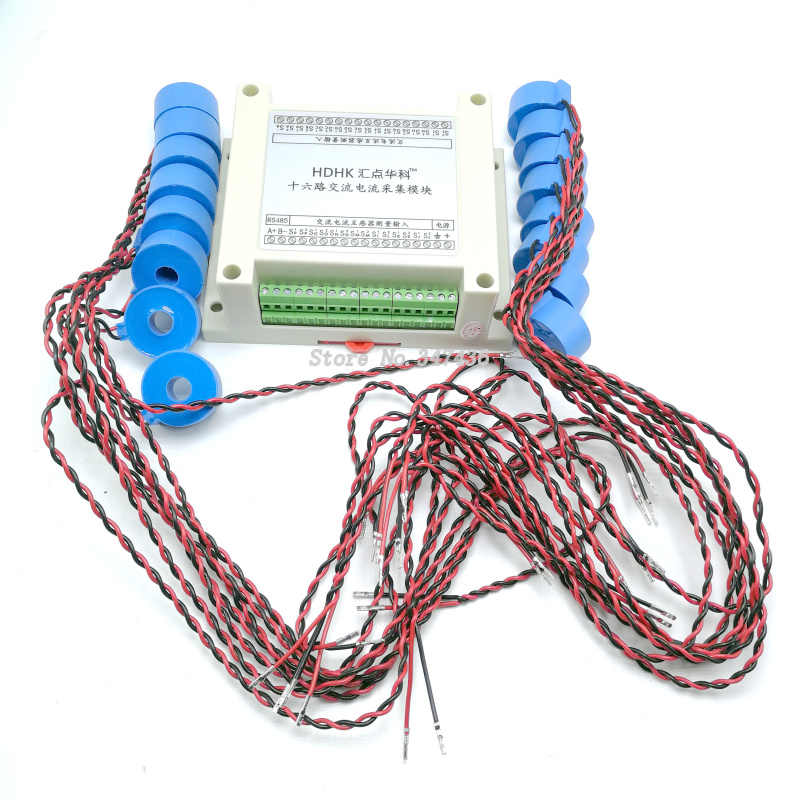

# Powermeter

**Powermeter** is a Python package for reading current values from **HDHK devices** (via RS-485 Modbus RTU) and exposing them in structured formats for monitoring and visualization.

## Features

- Reads Modbus RTU registers from HDHK devices
- Support for mutliple HDHK devices (each connected to the separated USB convertor)
- Provides easy-to-use API in Python (`get_values()`)
- Outputs JSON for use in Zabbix, InfluxDB, or other monitoring systems
- Can be run as a service or from CLI
- Easily extensible and modular

## Usage examples:

- **Datacenter** - You can measure power consumption of each phase/fuse/circuit directly inside electrical switchboard. It will give you information about load balanced over the phases. So you can better balance your load with keep in mind UPS capacity. You can measure and bill power consumption for your customers load. You can detect and alert/prevent overload, etc.
- **Home** - You can monitor and visualise your power consumption at home.
- **Camp** - Measurement of power consuption on caravan sites.
- **Other** - Depends on your needs and fantasy.

## Data processing:

- **Zabbix Agent** - "custom values" script using Powermeter package for reading values and provide them for further processing and visualisation in the Zabbix server.
- **InfluxDB + Grafana** - service using Powermeter package for geting values periodicaly and store them in the InfluxDB. Grafana can be used for visualisation.
- **Other** - you can yse this package in other Python-based project based on your curent needs.

---

## Hardware Setup

**Security notice** - HDHK device produced in China. I am not sure if it meet all EU requirements for electronic devices. It should be installed by person who is profesional in electronic installations. It is by its purpose (indirect current measurement) galvanicaly separated from the high voltage circuits.

**HDHK device** 
- 16x input for AC current measuring transformers
- powered by 12V DC
- RS485 modbus rtu



HDHK Device is powered by 12V DC power supply. Data are read via RS485 bus (modbus-rtu) which is connected by RS485/USB converter to the server (any computer running linux). Software using Powermeter python package can read values from the HDHK devices and provide them for further processing.

Diagram:


---

## Installation

As Pyhon package (prefered way)

```bash
# Create virtualenv
python3 -m venv /opt/powermeter-venv
source /opt/powermeter-venv/bin/activate

# Install
pip install -e .

# To update dependencies
pip install --upgrade -e
```

Configuration

```bash
# Copy config file
mkdir -p /etc/powermeter
cp config/powermeter/powermeter_config.json /etc/powermeter/powermeter_config.json

# Edit config file
nano /etc/powermeter/powermeter_config.json
```

---

## Basic Usage (Python Package)

You can use Powermeter directly in your Python code:

```python
from powermeter import get_values

values = get_values('/etc/powermeter/powermeter_config.json')
print(values)
```

Run your script:

```bash
/opt/powermeter-venv/bin/python3 <your-script>.py
```