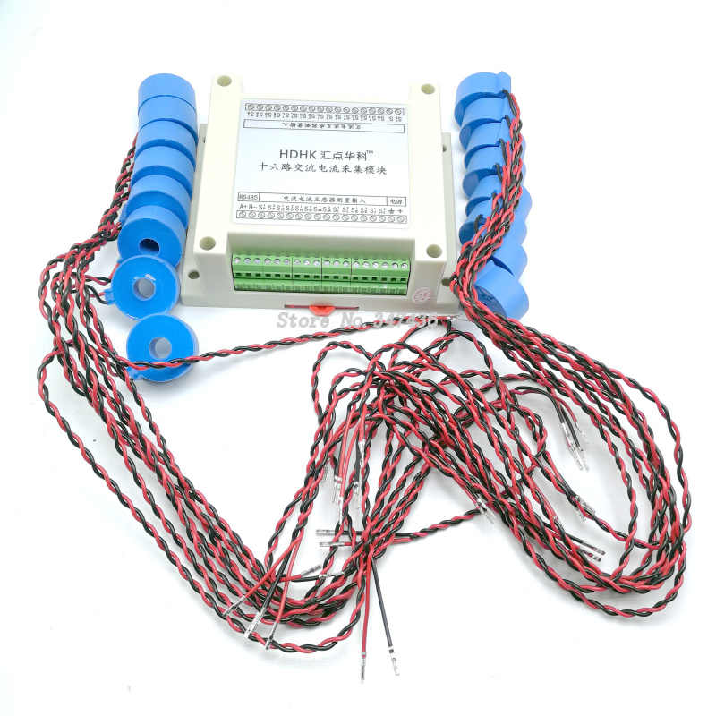

# 🛠️ Hardware Installation

## ⚠️ Safety Notice

The HDHK device is produced in China and may not fully comply with EU regulations for electronic equipment. Installation should be performed by a qualified electrician. A positive aspect is that the device uses indirect current measurement and is galvanically isolated from high-voltage circuits.

## 📋 HDHK Device Specifications

- 16x input for AC current measuring transformers
- Powered by 12V DC
- RS485 Modbus RTU



The HDHK device is powered by a 12V DC power supply. Data is read via the RS485 bus (Modbus RTU), which is connected to the server using an RS485/USB converter (any Linux-based system). Software based on the Powermeter Python package reads values from HDHK devices and makes them available for further processing.

When using multiple HDHK devices, you must use separate RS485/USB converters for each device. It is not possible to connect them on a shared RS485 bus, as the devices have fixed addresses.

You can use the original `DL-CT08CL2` current transformers (ratio 0.01) supplied with the HDHK device, or alternative models. For example, the `SCT013-030` (ratio 0.0245) with a split-core design has been tested — it allows installation without interrupting the circuit.

## 🔌 Connection Diagram


## 🔗 RS485/USB Converter

It is possible to use any RS485/USB connector. 

### Tested models:
 
PremiumCord KU2-232D


Noname converter from Aliexpress


### Configuring Udev Rules for USB RS485 Converters

When using multiple RS485 converters, it is important to ensure consistent device naming (for example /dev/ttyUSBPWR1, /dev/ttyUSBPWR2, etc.), especially after system reboot.

By default, Linux assigns /dev/ttyUSB* device names dynamically — which **can change at each boot**.

To achieve stable device names, you should configure udev rules.
An example udev rule file is provided in this project:

```bash
config/udev/99-usb-serial.rules
```

You can adapt this example to your USB converter types and install it into your system's udev rules directory:

```bash
sudo cp config/udev/99-usb-serial.rules /etc/udev/rules.d/

# Edit the ID_PATH value to match your local device path.
sudo nano /etc/udev/rules.d/99-usb-serial.rules

# Apply changes.
sudo udevadm control --reload-rules
sudo udevadm trigger
```

After configuration, your RS485 devices will always appear with stable device names, even after reboot.

## 🔍 Troubleshooting

Show 'udev' information about specified tty device:

```bash
udevadm info --name=ttyUSB1

P: /devices/pci0000:00/0000:00:12.0/usb4/4-4/4-4:1.0/ttyUSB1/tty/ttyUSB1
N: ttyUSB1
S: serial/by-id/usb-1a86_USB2.0-Ser_-if00-port0
S: serial/by-path/pci-0000:00:12.0-usb-0:4:1.0-port0
S: ttyUSBPWR2
E: DEVLINKS=/dev/serial/by-id/usb-1a86_USB2.0-Ser_-if00-port0 /dev/serial/by-path/pci-0000:00:12.0-usb-0:4:1.0-port0 /dev/ttyUSBPWR2
E: DEVNAME=/dev/ttyUSB1
E: DEVPATH=/devices/pci0000:00/0000:00:12.0/usb4/4-4/4-4:1.0/ttyUSB1/tty/ttyUSB1
E: ID_BUS=usb
E: ID_MODEL=USB2.0-Ser_
E: ID_MODEL_ENC=USB2.0-Ser\x21
E: ID_MODEL_FROM_DATABASE=HL-340 USB-Serial adapter
E: ID_MODEL_ID=7523
E: ID_PATH=pci-0000:00:12.0-usb-0:4:1.0
E: ID_PATH_TAG=pci-0000_00_12_0-usb-0_4_1_0
E: ID_REVISION=0254
E: ID_SERIAL=1a86_USB2.0-Ser_
E: ID_TYPE=generic
E: ID_USB_CLASS_FROM_DATABASE=Vendor Specific Class
E: ID_USB_DRIVER=ch341
E: ID_USB_INTERFACES=:ff0102:
E: ID_USB_INTERFACE_NUM=00
E: ID_VENDOR=1a86
E: ID_VENDOR_ENC=1a86
E: ID_VENDOR_FROM_DATABASE=QinHeng Electronics
E: ID_VENDOR_ID=1a86
E: MAJOR=188
E: MINOR=1
E: SUBSYSTEM=tty
E: TAGS=:systemd:
E: USEC_INITIALIZED=8881424928195
```

Apply changes to udev rules:

```bash
udevadm control --reload-rules
```

Monitor information about just connected device:

```bash
udevadm monitor
```

List tty devices from dmesg:

```bash
sudo dmesg | grep tty

# <... some output omited...>
[1337106.956447] ch341-uart ttyUSB0: break control not supported, using simulated break
[1337106.956758] usb 3-2: ch341-uart converter now attached to ttyUSB0
```

## 🏗️ Example installation

Detail of measuring transformer installation


Detail of HDHK device instaled in the el. switchboard


Electronic switchboard


