# 🧩 Setting Up InfluxDB and Grafana for Powermeter

Ensure your hardware is already installed and configured as described in the [Hardware Installation Guide](hardware.md)


## ⚙️ Install and Configure Powermeter service

Run the following commands as **root**:

```bash
# Install git and clone repository
apt update 
apt install -y git python3-venv python3-pip

git clone https://github.com/lukaskaplan/powermeter
cd powermeter

# Create python virtualenv
python3 -m venv /opt/powermeter-venv
source /opt/powermeter-venv/bin/activate

# Install package
pip3 install -e .
pip3 install influxdb_client

# Create config dir and copy config files
mkdir -p /etc/powermeter
cp config/powermeter/* /etc/powermeter

# Modify config files
nano /etc/powermeter/influx.conf
nano /etc/powermeter/powermeter.json

# Prepare powermeter service
cp scripts/powermeter_influx.py /usr/local/bin/
chmod +x /usr/local/bin/powermeter_influx.py
cp config/systemd/powermeter.service /etc/systemd/system/powermeter.service

# Reload systemd units
systemctl daemon-reload

# Enable service to start at boot
systemctl enable powermeter.service

# Start service
systemctl start powermeter.service

# Check status
systemctl status powermeter.service

# Check logs
journalctl -u powermeter.service -f 
```


## 🚀 Deploy InfluxDB + Grafana

 Here is an example docker-compose.yml configuration for deploying InfluxDB and Grafana:

```yml
services:
  influx:
    image: influxdb:2.8
    restart: always
    volumes:
      - influx_data:/var/lib/influxdb
      - influx_config:/etc/influxdb2
    ports:
      - 8086:8086

  grafana:
    image: grafana/grafana:12.0.1
    restart: always
    volumes:
      - grafana:/var/lib/grafana
    ports:
      - 3000:3000

volumes:
  influx_data:
  influx_config:
  grafana:
```

To start the containers:

```bash
nano docker-compose.yml
docker compose up -d
```


## 🛠️ Configure InfluxDB

### 1. Open the InfluxDB web GUI.

### 2. Configure admin / password, Organization name and Bucket name.

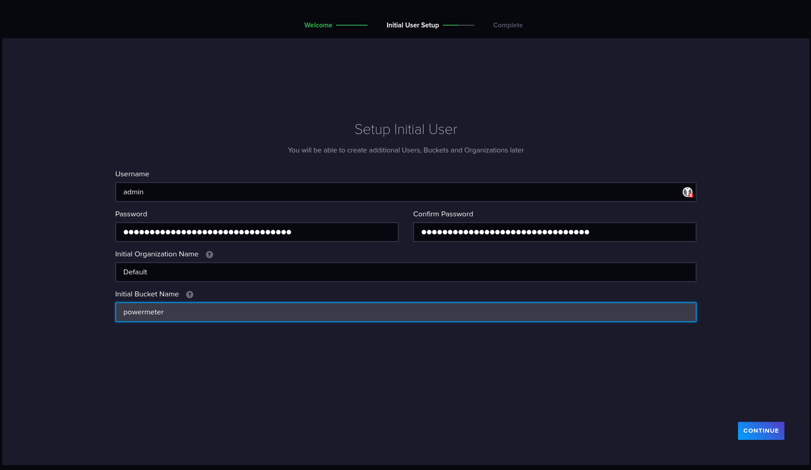

### 3. Click on "CONFIGURE LATER".

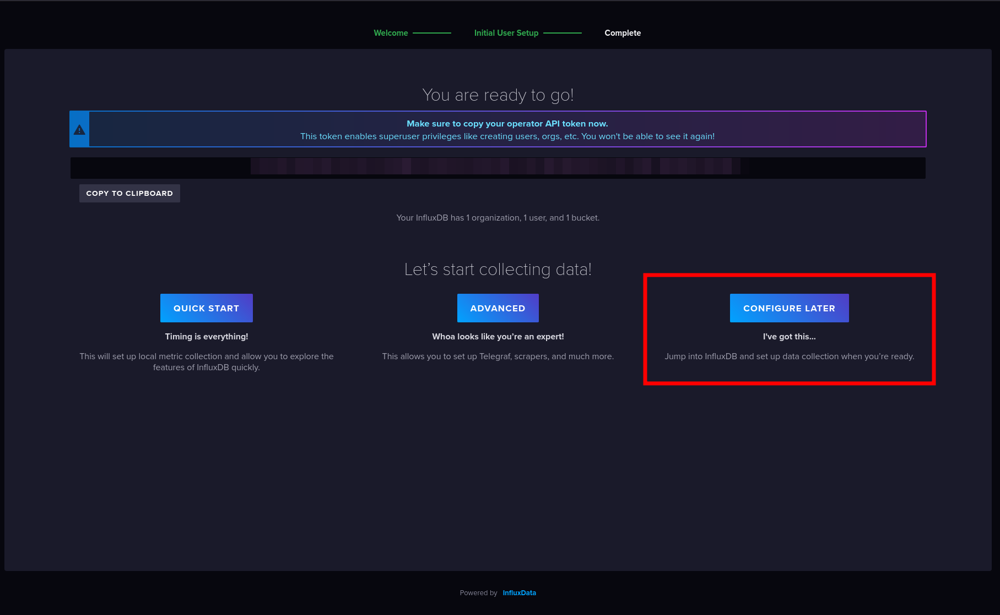

### 4. Go to "API tokens".

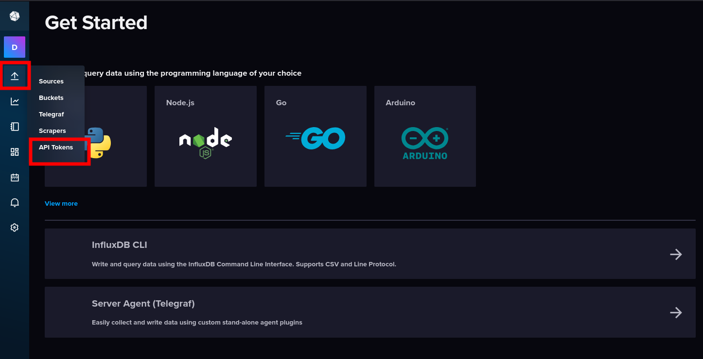

### 5. Create "Custom API token".

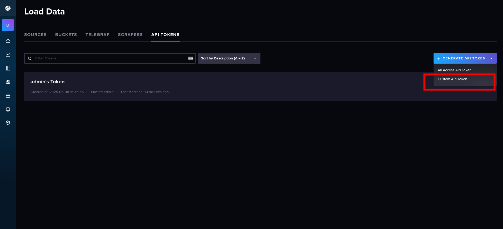

### 6. Set Description and Read/Write permissions for "powermeter" bucket.

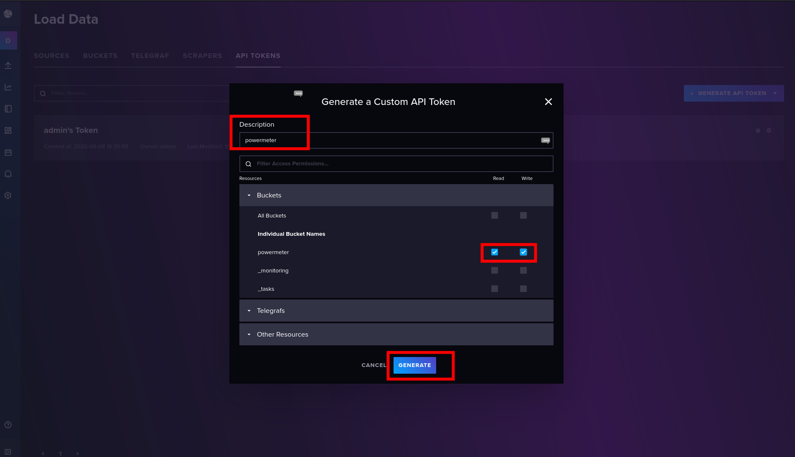

### 7. Copy generated API token and put it in the `/etc/powermeter/influx.conf` file. And restart powermeter service `systemctl restart powermeter.service`.

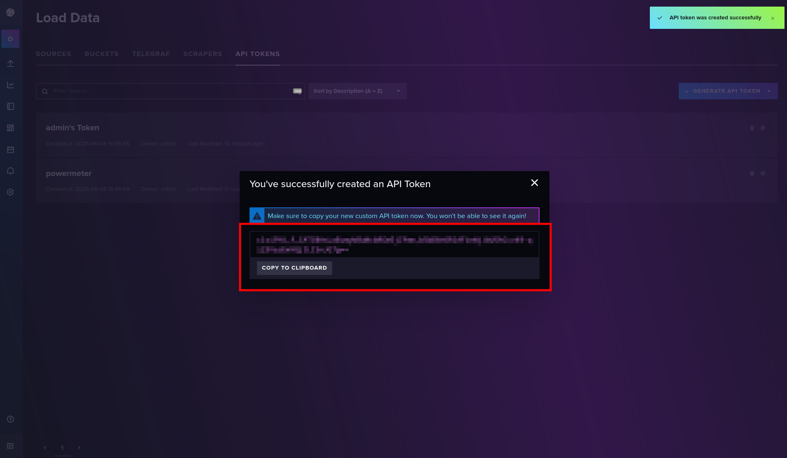

### 8. Go to "Data explorer" and configure the following query. When you click on Submit, you should see the first data points appear on the graph.

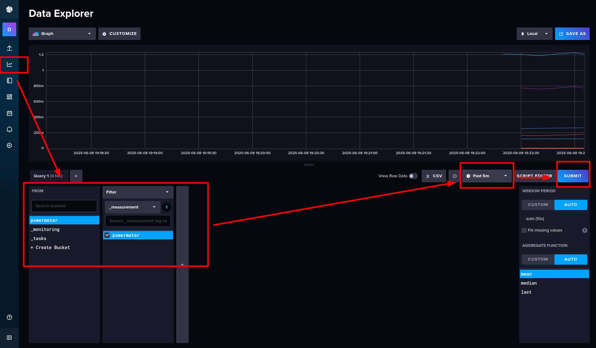


## 🔗 Configure Grafana and InfluxDB connection

Before configuration of Grafana, be sure you have prepared InfluxDB API Token, Organization name and Bucket name

InfluxDB API Token can be same as for powemeter. However, it is recommended to create a separate token specifically for Grafana.

### 1. Login to Grafana

Default username and password: `admin` / `admin`


### 2. Configure new admin password

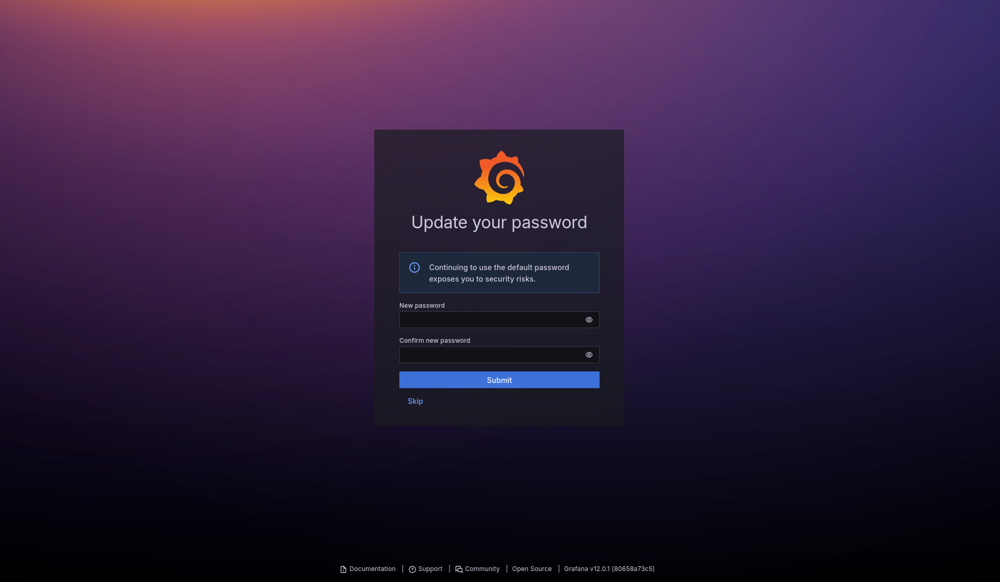

### 3. go to "Data sources"

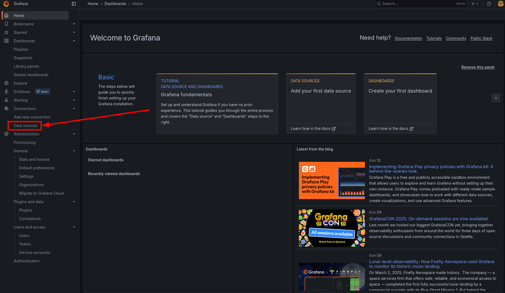

### 4. "Add data source"

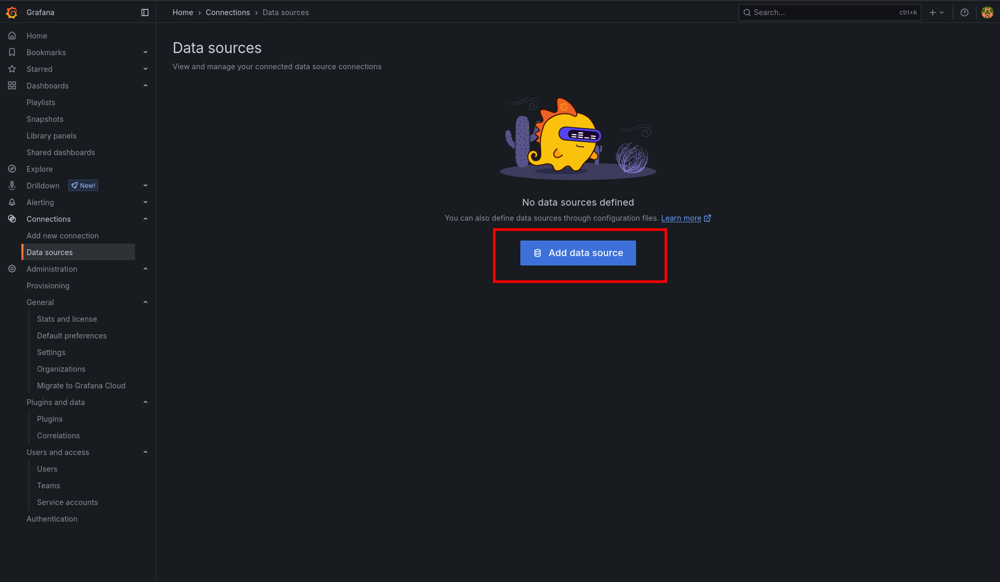

### 5. Add InfluxDB data source

💡 Tip: Use the search bar to quickly find InfluxDB.

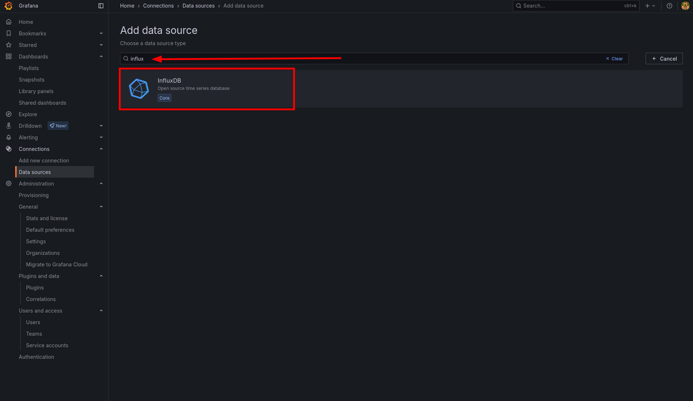

### 6. Configure InfluxDB connection (part 1)

- Configure name of the connection
- Select `InfluxQL` Query language
- Fill in URL of the InfluxDB server

and scroll down

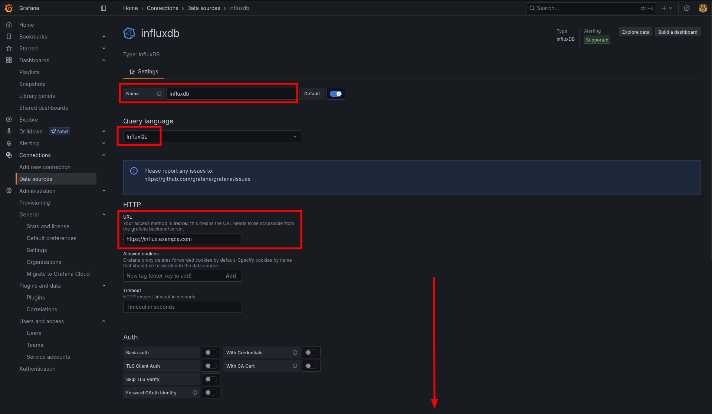

### 7. Configure InfluxDB connection (part 2)

- Find section "Custom HTTP headers".
- Click "+ Add header"
- Fill in:
  - Header: Authorization
  - Value: Token <influxdb-api-token>
- Set database name (powermeter)
- Click "Save and Test"

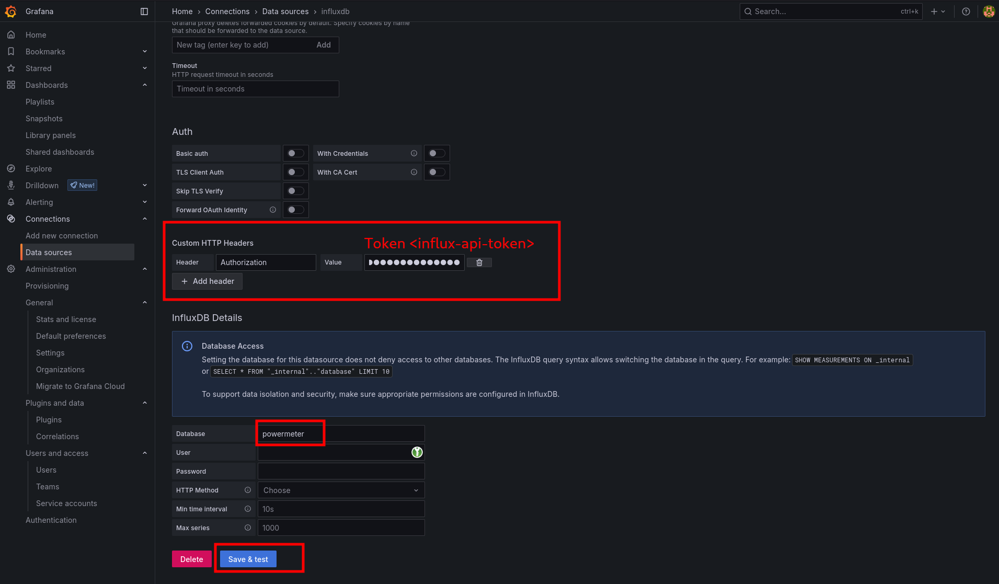

### 8. InfluxDB connection is working

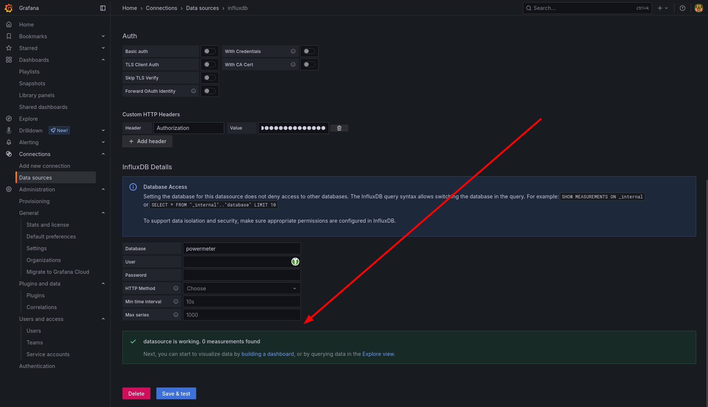


## 📊 Create Grafana Dashboard

### 1. Create dashboard

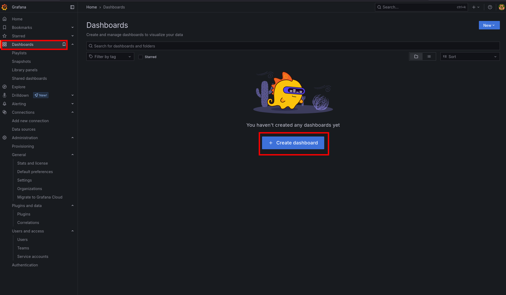

### 2. Add visualisation

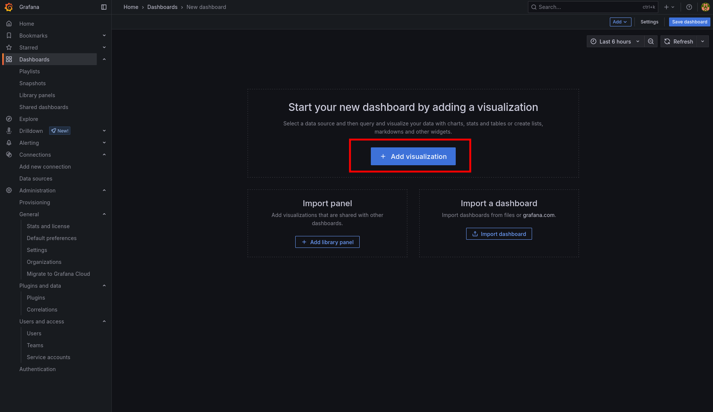

### 3. Select data source (influxdb)

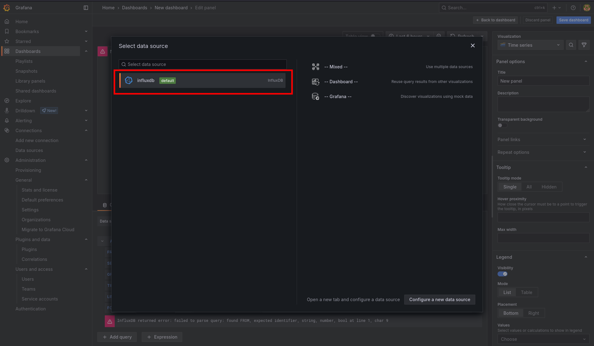

### 4. Configure query and set Visualisation type "Gauge"

- Then configure the visualization appearance – set the title, units, minimum/maximum values, thresholds, and more.
- Example dashboard: [powermeter.json](../config/grafana-dashboards/powermeter.json)

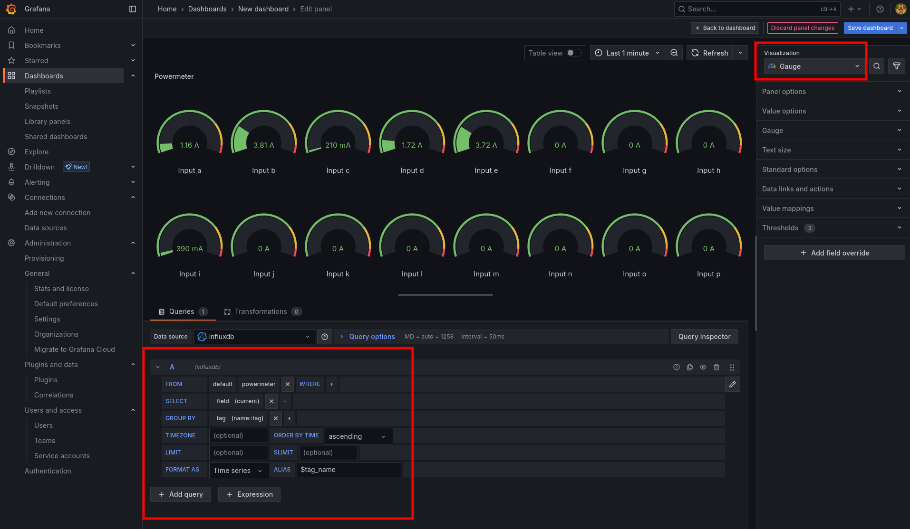
