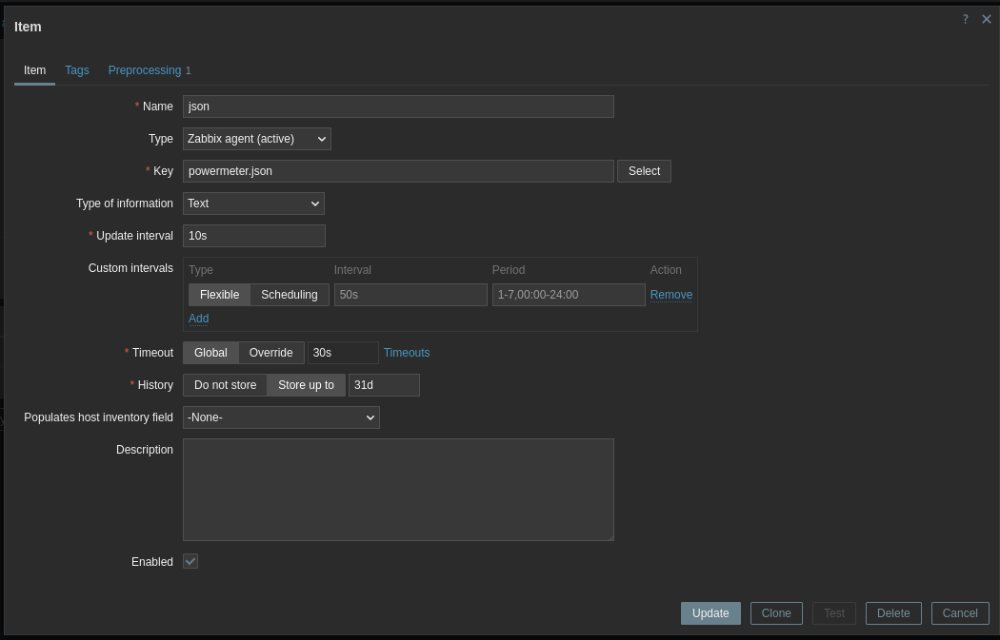
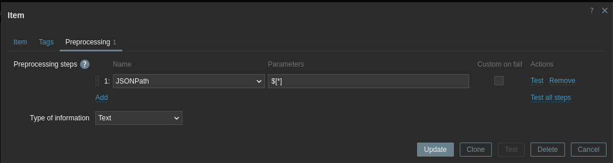
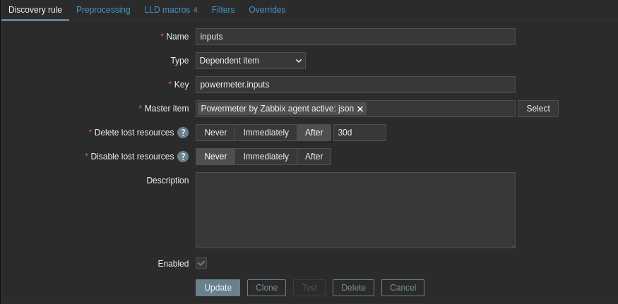
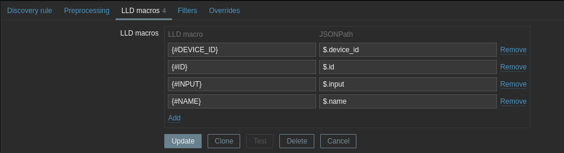
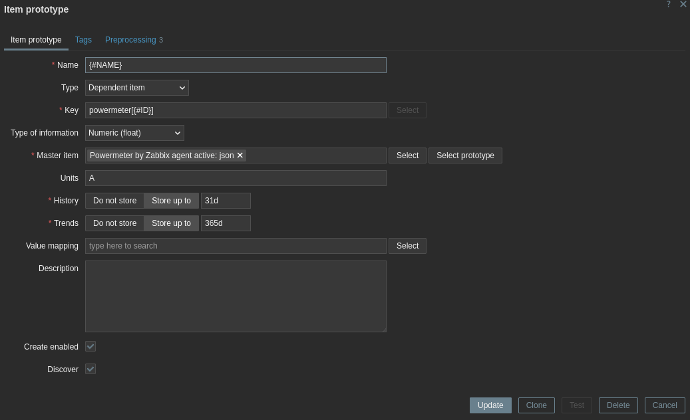
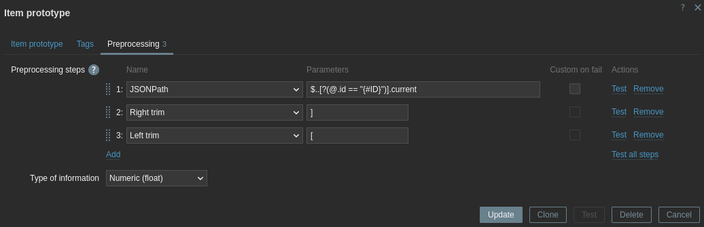

# 🔧 Zabbix Integration Guide

Before you begin, ensure that `zabbix_agent2` is already installed and properly configured on the host system.


## 🛠️ Configure Zabbix_agent2

Run the following commands as **root**:

```bash
# Install git and clone repository
apt update 
apt install -y git python3-venv python3-pip

git clone https://github.com/lukaskaplan/powermeter
cd powermeter

# Create python virtual environment
python3 -m venv /opt/powermeter-venv
source /opt/powermeter-venv/bin/activate

# Install package
pip3 install -e .

# Set up configuration
mkdir -p /etc/powermeter
cp config/powermeter/powermeter.json /etc/powermeter

# Edit configuration file
nano /etc/powermeter/powermeter.json

# Copy the Powermeter script
cp scripts/powermeter_json.py /usr/local/bin/

# Configure Zabbix agent
cp config/zabbix_agent/userparameter-powermeter.conf /etc/zabbix/zabbix_agent2.d/userparameter-powermeter.conf
usermod -aG dialout zabbix
systemctl restart zabbix-agent2.service
```


## 🧪 Test the Zabbix agent UserParameter

```bash
sudo -u zabbix zabbix_agent2 -t powermeter.json
```

If successful, the output will be JSON similar to:

```json
[
    {
        "id": 0,
        "device_id": 1,
        "input": "a",
        "name": "Input a",
        "current": 0.92
    },
    {
        "id": 1,
        "device_id": 1,
        "input": "b",
        "name": "Input b",
        "current": 0.14
    },
    ...
]
```


## 🧩 Zabbix Server Setup

You can either use the predefined templates or configure Zabbix manually. Both options are just examples of how to integrate Powermeter with Zabbix. You are expected to set up triggers, graphs, and dashboards according to your needs.

### Option 1: Use Predefined Templates

Two nearly identical templates are provided:

 - Powermeter by Zabbix agent
 - Powermeter by Zabbix agent active

Templates for different Zabbix versions:

 - [Zabbix server 6.x](../config/zabbix_server_templates/zabbix_powermeter_templates_6_4.yaml)
 - [Zabbix server 7.x](../config/zabbix_server_templates/zabbix_powermeter_templates_7_0.yaml)

### Option 2: Manual configuration

You can configure the following at the host level or within a template.

#### 1. Item

Item:

- Name: json
- Type: Zabbix agent or Zabbix agent (active)
- Key: powermeter.json
- Type of information: Text
- Update interval: 10s



Preprocessing:

- Preprocessing steps:
  - Name: JSONPath
  - Parameters: `$[*]`
- Type of information: Text



#### 2. Discovery rule 

Discovery rule:

- Name: inputs
- Type: Dependent item
- Key: powermeter.inputs
- Master item: <host-or-template>:json



LLD macros:

- {#DEVICE_ID} - `$.device_id`
- {#ID} - `$.id`
- {#INPUT} - `$.input`
- {#NAME} - `$.name`



#### 3. Item prototype

Item prototype:

- Name: `{#NAME}`
- Type: Dependent item
- Key: powermeter[{#ID}]
- Type of information: Numeric (float)
- Master item: <host-or-template>:json
- Units: A



Preprocessing:
- JSONPath - `$..[?(@.id == "{#ID}")].current`
- Right trim - `]`
- Left trim - `[`
- Type of information: Numeric (float)


